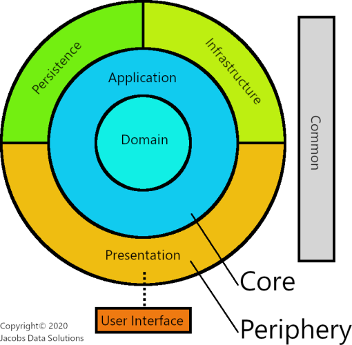

# Clean Architecture

La Clean Architecture è un approccio progettuale che enfatizza la separazione dei livelli e l'indipendenza dalle tecnologie, garantendo maggiore flessibilità e manutenibilità del codice.

Verranno definiti 3 livelli:
- **Core**: Comprende i componenti più interni (Domain e Application). Il Domain rappresenta le regole di business e le entità, mentre l'Application contiene i casi d'uso.
- **Infrastructure**: Contiene i dettagli di implementazione, come database (Persistence) e altre tecnologie di supporto.
- **Presentation**: Si occupa dell'interfaccia utente e dell'interazione con l'utente finale.
